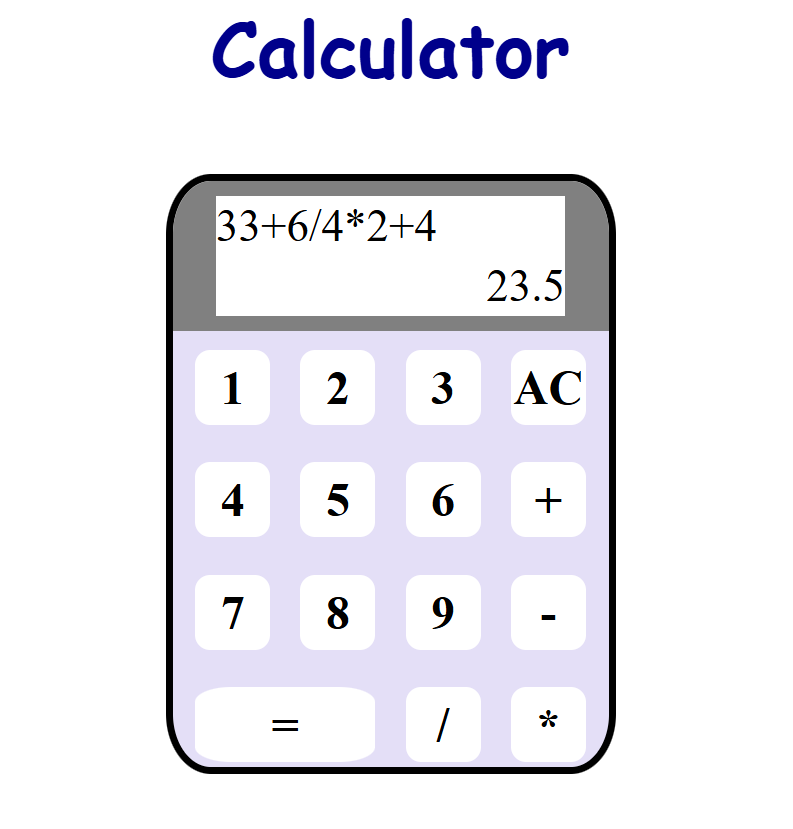
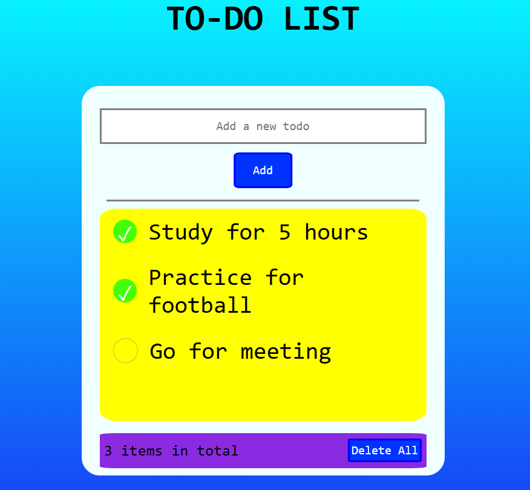

# Web Applications: Calculator & To-Do List 🧮✅

This repository features two beginner-friendly web projects built using **HTML**, **CSS**, and **JavaScript**. They demonstrate fundamental front-end skills with interactive UIs and local storage usage.

---

## 🔢 Calculator

A clean and responsive calculator capable of performing **basic arithmetic operations** including addition, subtraction, multiplication, and division. The logic is handled with JavaScript, and the UI is styled for an intuitive experience.

### ✅ Features
- User-friendly number pad  
- Real-time calculation preview  
- AC (All Clear) functionality

### 📸 Screenshot

<p align="center">
  
</p>

---

## 📝 To-Do List

A fully functional To-Do List web application that allows users to:
- Add new tasks  
- Mark tasks as complete/incomplete  
- Edit task text  
- Remove individual or all tasks  
- Persist tasks using **localStorage**

### ✅ Features
- Task tracking with checkmarks  
- Local storage for data persistence  
- Total item count  
- Color-coded task blocks

### 📸 Screenshot

<p align="center">
  
</p>

---

## 🛠️ Technologies Used
- HTML5  
- CSS3  
- JavaScript (Vanilla)  
- LocalStorage (for the To-Do List)

---
## 🚀 Getting Started

1. Clone this repo:
   ```bash
   git clone https://github.com/your-username/web-calc-todo-apps.git
   ```

2. Navigate into each project folder and open `index.html` in your browser to run locally.

---

## 📂 Folder Structure (Example)
```
web-calc-todo-apps/
├── calculator/
│   ├── index.html
│   ├── style.css
│   └── script.js
├── todo-list/
│   ├── index.html
│   ├── style.css
│   └── script.js
└── README.md
```

---

## 📄 License

This project is open-source and free to use for learning purposes.

---

Happy coding! 🎉
